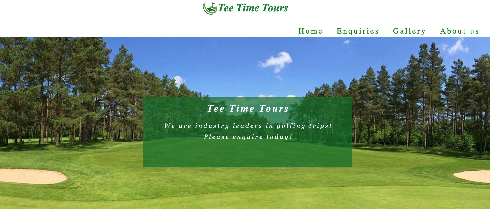
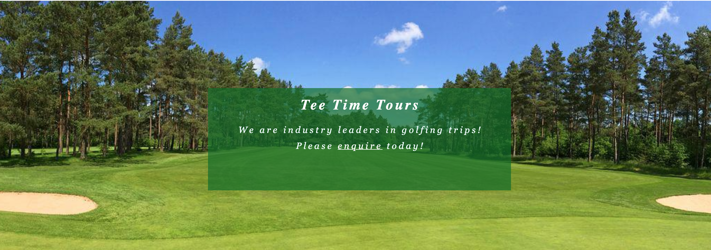
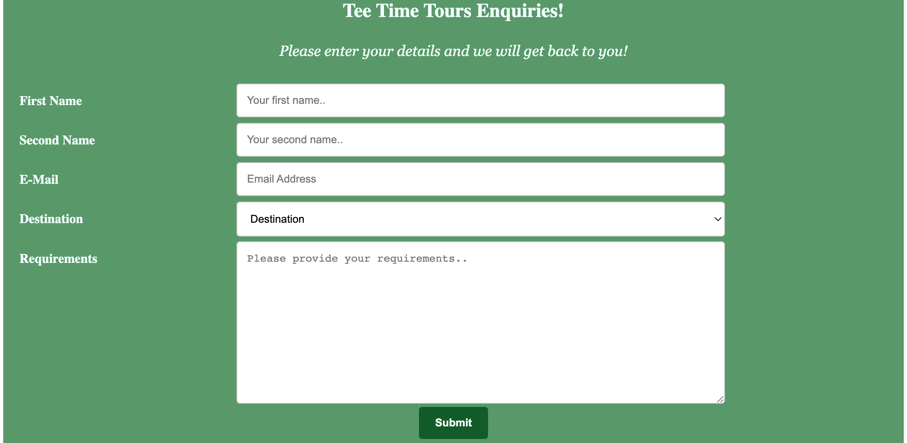
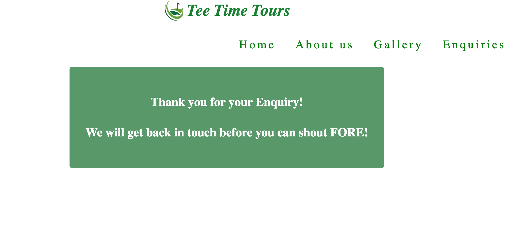

# Tee Time Tours

Tee Time Tours is a site that offers the assistance in hassle free booking of golfing trips and tours. Visitors to the web site can view some popular golfing destinations via our gallery page. They can suggest a location and all other requirements via our enquiry page. Our team will take this information and come back with some suggestions and options based on wants and needs. When the customer decides on what they would like, the representative will then organise and book the trip and send back all details.

## Features 

This website has many cool features, including seamless navigation, eye catching photo gallery, clear descriptions of what is on offer and an overall fun effortless experience.

### Existing Features

- __Navigation Bar__

  - Featured on all three pages, the full responsive navigation bar includes separate links to Home page, Gallery,  Enquiries and About us Pages. The user can also navigate to the home page from anywhere on the site by clicking on the main logo and company name. The menu will indicate what page the user is currently residing by underlining the menu option. Each page will have the exact menu layout for familiarity.
  - This section will allow the user to easily navigate from page to page across all devices without having to revert back to the previous page via the ‘back’ button.
  - Each menu item will highlight by enlarging slightly by becoming underlined and bold when scrolled over.

- __The landing page image__

  - The landing includes a photograph with text overlay which immediately grabs the users attention and gives a short clear message to aid the user in knowing exactly where they are and where they can go to next!

- __Popular Destinations Section__

  - The Popular Destinations section will allow the user to see some beautiful images of locations that they can book with us to get the mouth watering!
  - This user will quickly see and understand the different locations that are available that they may not have orginally been thinking of.

- __The Footer__ 

  - The footer section includes links to the relevant social media sites for Tee Time Tours. The links will open to a new tab to allow easy navigation for the user. 
  - The footer is valuable to the user as it encourages them to keep connected via social media.
  - Each Page on the Website will have the exact footer layout and options to keep familiarity and enhance accessibility.  Each logo has a shadowing effect to add a bit of pizazz.

- __Gallery__

  - The Gallery is another area on the Website that will get the juices running!  It shows off some of the stunning locations from our popular destinations and also shows some golfers that have used our site enjoying their time!
  - If the visitor was in any doubt about travelling to locations that they may not be familiar with for a typical golf trip, this will help them become adventurous!

- __The Enquiries Page__

  - This page allows the user to enter thier details, identify a desired location and then add any specific requirements they have (number of people, Golf clubs, buggys etc.)
  - Its a very straight forward no fuss page that is clear and easy to use for the user.
  - The submit button will change colour when scrolled over
  - When 'Submit' is clicked, if all required information is entered, this will take the user to a 'Thank you' page, detailing out next steps.  If all required information is not entered the page will remain with a message.

- __The Enquiry confirmation page__

- This page confirms to the user that their enquiry has been recieved and that someone will be back to them as soon as possible
- This page contains the standard comapny logo, navigations and footer social links as the other pages to allow for consistency and to allow user to navigate back to the site seemlessly.

### Features Left to Implement

- If time allowed and I was to enhance this Website, I would like to make the destinations section on the home page more interactive.  Currently they are dead images of locations..ideally, I would like the user to be able to click on a destination and then be brought to a page with different golf courses available in that location, and perhaps seperate gallery for each course.
- Another addition would be the review section on About us page.  Currently they are snippets of quaotes made by happy customers.  It would be great to make these short videos of actual people telling their story about the experience that they had.

## Testing 

Testing my website was a natural part of the development work on a day to day basis.  Each little change was then tried and tested.  So hundreds of tests were carried out as a natural progression.  These are not all documented.  However, when my site was at a point where its was fully functional and a place where I believed was consumable, I conducted further documented, comprehensive testing. I used an overall User Story for the Web Site and individual use cases to drive these tests. Please see [User Story and Functional Testing](https://docs.google.com/spreadsheets/d/1htQBVcgTHaQGAu9rQoSIUzo6yJ912onbbliXnAJKo1Q/edit#gid=0) 

## Original Wireframe

Before jumping into coding, I wanted to first put some thought into the idea and design of my Website.  The original design did not change too much, but as I got into the project, I decided on changing a few UX items and layouts.  Please see [Original Wireframes](https://docs.google.com/document/d/1jW4MrTrLhwpKfaKYJjZmGAH6zFFszIeQgD7nzF6flhc/edit?usp=sharing)

### Validator Testing 

- HTML
  - No errors were returned when passing through the official [ W3C validator ](https://docs.google.com/document/d/198fnSSi_k6_lecVZpa6_UWza2cENdGfKonlNGxNtse4/edit?usp=sharing)

- CSS
  - No errors were found when passing through the official [ CSS validator ](https://docs.google.com/document/d/1QXtULQXFJH5ErMEghDlz5PMPiGXwYzbYFGHuDv_GgEo/edit?usp=sharing)

- Lighthouse
  - I conducted lighthouse tests throughout the devlopment of my site.  On completion the results for both Mobile and Desktop are [Lighthouse](https://docs.google.com/document/d/15UYoawhhZp_XdYgbmVTz4k2W3-OfaGqSUQCvfBSOEcI/edit).  All scores above 90 and some at 100.

### Unfixed Bugs

From what I can see there is no bugs on my site.  I have identified areas in which I could improve if I were to further this project, but no obvious bugs. 
I am sure there are areas in which this site could be laid out better, have better use of images and colours etc.  I hope to learn more on this as I go further into the course.

## Deployment

- The site was deployed to GitHub pages. The steps to deploy are as follows: 
  - In the GitHub repository, navigate to the Settings tab 
  - From the source section drop-down menu, select the Master Branch
  - Once the master branch has been selected, the page will be automatically refreshed with a detailed ribbon display to indicate the successful deployment. 

The live link can be found here - https://kevinmcsherry.github.io/kevs_ci_project1/

## Credits 

I used a number of different websites and did a lot fo searching throughout the project.  I really tried to understand the logic that I was finding and implement in my own code, and not just copy and paste in.  I may have lost a lot of time here, but I wanted to understand and learn.
I used image and photo website referenced below and well known coding sites like Stackoverflow and W3Schools.  I would have really struggled without these reference points.

### Content 

- Rightly or wrongly, I really tried to use what I had learned through the course and general web searches on how to structure my site.  I did many searches and I was using [Stackoverflow](https://stackoverflow.com/) and [W3 Schools](https://www.w3schools.com/) quite a lot.  There are lots of great snippets of ideas here that helped me a lot.

- I used the Love Running project to help inspire me to overall site navigation and used the code here to help with with menu items and the responsiveness of these.

- I struggled a bit on my form, so I then turned to external help so the structure, layout and responsiveness of my enquiry form was quite heavily dervied via [W3 Schools](https://www.w3schools.com/howto/howto_css_contact_form.asp)

- I added some animation to text for the review section of the About us page, it took ideas and snippet of code from a source called [Alvarotrigo](https://alvarotrigo.com/blog/css-text-animations/)

- The icons in the footer were taken from [Font Awesome](https://fontawesome.com/)

- The submit button on my enquiry form needed to redirect to a page.  I used the form learning section in the Code Institute to add the redirection to form dump page.

### Media

- All images and photos I used for my site where found here [Pixabay](https://pixabay.com/)

### Project Summary

Overall I really enjoyed the project.  It certainly was frustrating at times, especially with the responsiveness side of it.  I made many mistakes throughout, like leaving the responsiveness to the end!!  I also think I dived in to early without a technical plan.  I had a good idea of design, but I feel I would create a wireframe of how the page would look technically also would have helped.  I found myself using a lot of ids in my CSS code where maybe ideally and better practise is to use Classes - I think this was part of where I jumped in and really just tried to get something working and looking right.
My site is fairly straight forward and not very fancy - but it took a lot of effort and I really hope I managed to hit all the criteria.
